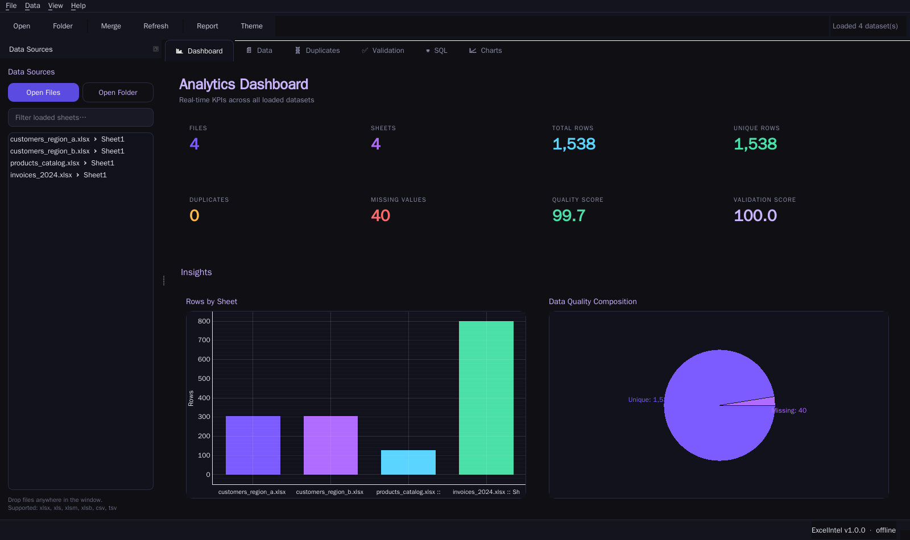
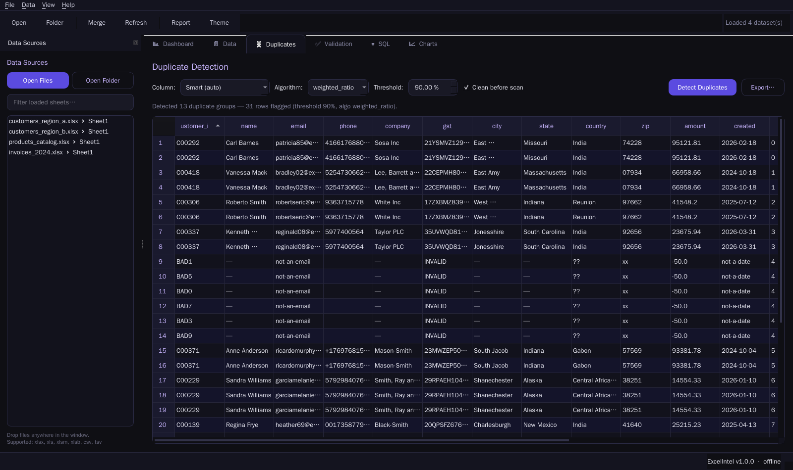

# ExcelIntel

**Enterprise Excel Analytics & Business Intelligence Platform**  —  a fully-offline, Python-only Power BI alternative specialised for Excel, CSV and spreadsheet data.

> Zero cloud. Zero API keys. Zero telemetry. Everything runs locally on your machine.

---

## Highlights

- **Modern PySide6 desktop UI** with dark & light themes, dockable panels, tabbed workspace and drag-and-drop.
- **High-performance engine** built on **Polars + PyArrow + DuckDB**, capable of millions of rows.
- **Smart duplicate detection** — exact, normalised, hash-based, token-based and 6 fuzzy algorithms (RapidFuzz).
- **Data cleaning** — Unicode normalisation, whitespace/case fixes, phone/email/currency normalisation.
- **Intelligent merge engine** — inner/left/right/outer joins with conflict detection & resolution.
- **Validation engine** — invalid emails, phones, GSTINs, ZIPs, dates, outliers, missing headers.
- **Power BI style dashboard** — KPI cards, bar/pie/line/scatter/histogram charts (PyQtGraph).
- **Ad-hoc SQL console** powered by DuckDB across all loaded datasets.
- **Exports** — styled Excel (colors, filters, freeze panes), PDF, HTML and JSON reports.
- **Project workspaces** — save/load `.eip` projects with recent files.
- **CLI** for headless / server-side workflows.
- **PyInstaller** packaging for Windows, macOS and Linux.

---

## Screenshots

<p align="center">
  <br/>
  <em>Analytics Dashboard — KPIs + bar/pie insights</em>
</p>

<p align="center">
  <br/>
  <em>Smart duplicate detection with confidence, method & reason</em>
</p>

---

## Installation

Python **3.10+** (recommended 3.11 / 3.13):

```bash
git clone <your-fork>
cd excelintel
python -m venv .venv && source .venv/bin/activate       # Windows: .venv\Scripts\activate
pip install -r requirements.txt
```

Generate the demo dataset:

```bash
python scripts/generate_samples.py samples
```

Launch the desktop app:

```bash
python run.py
# or
python -m bi_platform
```

---

## Command-line usage

```bash
# scan a folder for spreadsheets
python -m bi_platform.cli scan samples

# inspect a file
python -m bi_platform.cli info samples/customers_region_a.xlsx

# duplicate detection (auto column detection + fuzzy)
python -m bi_platform.cli duplicates samples/customers_region_a.xlsx --clean --threshold 90 --out /tmp/dups.xlsx

# merge two files
python -m bi_platform.cli merge samples/customers_region_a.xlsx samples/customers_region_b.xlsx --on customer_id --how outer --out merged.xlsx

# validate a sheet
python -m bi_platform.cli validate samples/customers_region_a.xlsx --out /tmp/val.xlsx

# generate a full report package (HTML + PDF + JSON + Excel)
python -m bi_platform.cli export-report samples --out reports/
```

---

## Architecture

```
bi_platform/
├── core/            # config, logging, constants
├── models/          # dataclasses (Dataset, DuplicateGroup, ...)
├── engine/          # ExcelEngine, CleaningEngine, FuzzyEngine,
│                    #  DuplicateEngine, MergeEngine, ValidationEngine,
│                    #  AnalyticsEngine
├── database/        # DuckDB / SQLite manager
├── export/          # ExcelExporter, ReportGenerator (PDF/HTML/JSON)
├── services/        # Project workspace persistence (.eip)
├── ui/
│   ├── theme.py     # dark / light QSS
│   ├── main_window.py
│   └── widgets/     # Dashboard, DataViewer, Duplicates, Validation,
│                    #  Merge Wizard, Charts, SQL Console
├── utils/
├── __main__.py      # GUI entry point
└── cli.py           # command-line interface
```

Clean architecture — engines are pure Python and fully testable without a display.

---

## Testing

```bash
pytest -q
```

28+ tests covering the Excel, duplicate, fuzzy, merge, validation, analytics and export engines.

---

## Packaging

Build a standalone binary with PyInstaller:

```bash
python scripts/build.py            # regular
python scripts/build.py --onefile  # single-file executable
```

Outputs to `dist/ExcelIntel/`.

---

## Roadmap

- [ ] Relationship auto-discovery across sheets (foreign key inference)
- [ ] Bookmarks + saved views
- [ ] Custom DAX-like measures
- [ ] Plugin system (drop-in Python files under `~/.excelintel/plugins/`)
- [ ] Real-time file watching + auto refresh
- [ ] Multi-monitor workspace persistence

---

## License

MIT © 2026 ExcelIntel contributors.
